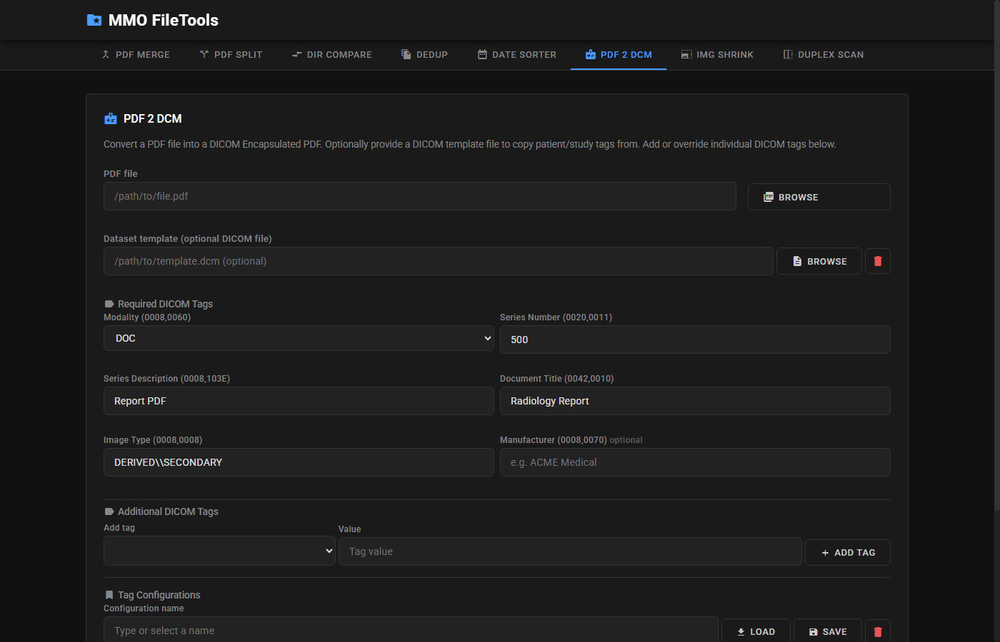
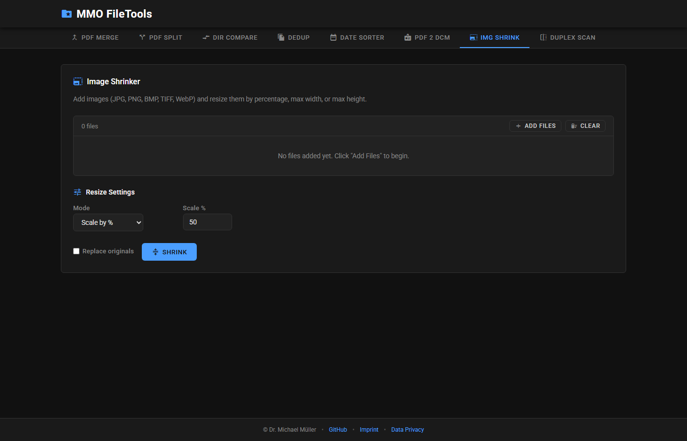
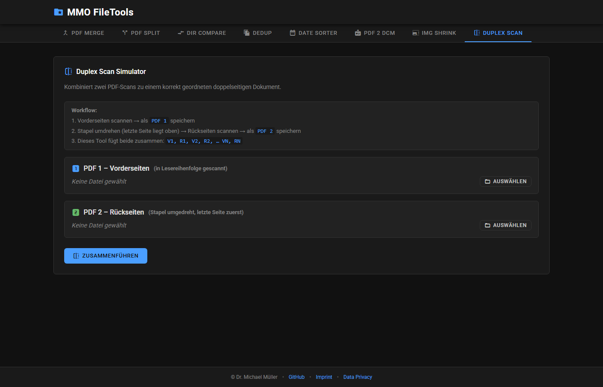

# MMO FileTools

A local-first desktop application for everyday file operations — eight tools covering PDF merging, splitting and duplex assembly, PDF-to-DICOM conversion, directory comparison & sync, duplicate detection, date-based photo sorting and image resizing. Built with **FastAPI**, **pywebview**, and a dark-themed single-page HTML frontend. All processing happens entirely on your machine; no data ever leaves your device.

> **Note:** This project was created with the help of AI (GitHub Copilot / Claude). Dr. Michael Müller is the author and maintainer.


---

## Features

| Tool | Purpose |
|---|---|
| [PDF Merge](#pdf-merge) | Combine PDFs and images into one document |
| [PDF Split](#pdf-split) | Extract page ranges, or split every page to PNG |
| [Dir Compare](#directory-compare--sync) | Compare two directories and sync them |
| [Dedup](#file-deduplication) | Find duplicate files and folders by content hash |
| [Date Sorter](#date-sorter) | Sort files into `YYYY/MM_Mon` by EXIF or file date |
| [PDF 2 DCM](#pdf--dicom) | Wrap a PDF in a DICOM Encapsulated PDF |
| [Img Shrink](#image-shrinker) | Batch-resize images by percentage or max edge |
| [Duplex Scan](#duplex-scan) | Interleave front and back scans into one PDF |

### PDF Merge
Combine multiple PDF files into a single document. Drag & drop to reorder files before merging.


### PDF Split
Extract specific page ranges from a PDF, or split every page into individual image files (PNG).


### Directory Compare & Sync
Compare two directories side by side. Shows files that are only in the left or right directory and files that differ. One-click sync to make both directories match.


### File Deduplication
Scan a directory tree for duplicate files and folders using xxHash3-128. Results are cached in a temporary database for fast re-scanning. Delete duplicates to the Recycle Bin.


### Date Sorter
Sort files (especially photos) into `YYYY/MM_Mon` subdirectories based on their creation date. Reads **EXIF metadata** (`DateTimeOriginal`) for accurate photo dates, falling back to filesystem timestamps.


### PDF → DICOM
Convert a PDF into a DICOM Encapsulated PDF. Patient and study tags can be copied from an existing DICOM template file, and individual tags added or overridden. Tag sets can be saved as named configurations and reloaded.



### Image Shrinker
Batch-resize JPG, PNG, BMP, TIFF and WebP images — by percentage, maximum width or maximum height. Writes alongside the originals, or replaces them when explicitly enabled.



### Duplex Scan
Assemble a double-sided document from a simplex scanner. Scan all front sides, flip the stack and scan the backs (which then arrive last-page-first); this tool interleaves both PDFs into the correct reading order.



---

## Installation

### Prerequisites

- **Python 3.11+**
- **Windows 10/11** (pywebview uses EdgeChromium; other platforms may work in web mode)

### Quick Start

```bash
# Clone the repository
git clone https://github.com/MichaelMueller/mmo_file_tools.git
cd mmo_file_tools

# Create a virtual environment
python -m venv .venv

# Activate the environment
# Windows PowerShell:
.venv\Scripts\Activate.ps1
# Windows CMD:
.venv\Scripts\activate.bat
# Linux / macOS:
source .venv/bin/activate

# Install dependencies
pip install -e ".[dev]"
```

### Run

```bash
# Desktop mode (default) — opens a native window
python mmo_file_tools.py

# Web mode — opens a plain HTTP server on port 8000
python mmo_file_tools.py --web

# Build a Windows NSIS installer
python mmo_file_tools.py installer
```

---

## Docker (web mode)

Runs the FastAPI app in a container, optionally behind an OIDC login. Desktop
mode is not containerised — it needs a native window.

```bash
cp .env.example .env      # then edit
docker compose up -d      # http://localhost:6080
```

The `COMPOSE_PROFILES` variable in `.env` is the only switch that matters:

| `COMPOSE_PROFILES` | Result |
|---|---|
| `open` | App published directly on `MMO_PORT`, **no authentication** |
| `auth,p-<slug>,…` | App has no published port; each `p-<slug>` adds one `oauth2-proxy` for one OIDC provider, with its own port and whitelists |

### Working directory

The **path-based** tools (Dir Compare, Dedup, Date Sorter) operate on the
server's filesystem, so the host directory `MMO_DATA_DIR` (default `./data`) is
mounted at `/data`. Paths typed into the UI are container paths —
`/data/photos`, not `C:\Users\…`. The directory must be writable by
`APP_UID`/`APP_GID`.

The **upload-based** tools (PDF Merge/Split/Duplex, Image Shrinker) never touch
it: they buffer each upload in a temp file, delete it in a `finally` block, and
stream the result back as a download. So if you only need those, leave
`MMO_DATA_DIR` pointing at the empty `./data` — nothing persists server-side and
the path-based tools are simply unusable, which is also the smaller attack
surface. The one exception is `/api/pdf/upload-temp`, which deliberately keeps
its temp file and never cleans up; those files live in the container's writable
layer and disappear on restart.

Two desktop-only features degrade in the container: the native file/folder
dialogs return HTTP 503 (type paths instead), and "open in file manager" is a
no-op because no desktop session exists. Dedup deletion moves files to a trash
folder inside the container volume rather than a host Recycle Bin.

### Protecting the UI with OIDC

Several providers can run side by side, each with its own whitelists. Because
one `oauth2-proxy` instance speaks to exactly one provider, each provider gets
its own instance on its own port — and, in front of it, its own hostname:

| Provider | Profile | Port | Hostname |
|---|---|---|---|
| own IdP | `p-mbits` | `6080` | `files.mbits.info` |
| customer A | `p-kunde-a` | `6081` | `files-kunde-a.mbits.info` |
| customer B | `p-kunde-b` | `6082` | `files-kunde-b.mbits.info` |

Activate the ones you need and fill in their blocks in `.env`:

```ini
COMPOSE_PROFILES=auth,p-mbits,p-kunde-a

OIDC_MBITS_ISSUER_URL=https://kc.mbits.info/realms/intern
OIDC_MBITS_CLIENT_ID=mmo-file-tools
OIDC_MBITS_CLIENT_SECRET=…
OIDC_MBITS_REDIRECT_URL=https://files.mbits.info/oauth2/callback
OIDC_MBITS_ALLOWED_DOMAINS=mbits.info            # everyone @mbits.info
OIDC_MBITS_ALLOWED_EMAILS=                       # …and nobody else
OIDC_MBITS_COOKIE_SECRET=…                       # openssl rand -base64 32
OIDC_MBITS_PORT=6080

OIDC_KUNDE_A_ALLOWED_DOMAINS=                    # no whole domain…
OIDC_KUNDE_A_ALLOWED_EMAILS=chef@kunde-a.de, azubi@kunde-a.de   # …only these
```

To add a fourth provider, copy a service block in `docker-compose.yml`, replace
the slug in its name, `COOKIE_NAME` and `AUTHENTICATED_EMAILS_FILE`, then add its
`OIDC_<SLUG>_*` variables and profile. The whitelists themselves need no change
there — they are discovered from `.env` (see below).

Every provider needs a *confidential* client (ID + secret) with the `email`
scope; without an email claim neither whitelist can match. Register each
`REDIRECT_URL` verbatim at its provider — the `/oauth2/callback` path is fixed
by oauth2-proxy. Give each instance its own `COOKIE_SECRET`; the cookie names
are already distinct per provider and no `COOKIE_DOMAIN` is set, so sessions
stay bound to their own hostname and cannot be replayed against another
provider's entry point.

#### How the two whitelists combine

`ALLOWED_DOMAINS` and `ALLOWED_EMAILS` are combined with **OR**: a user is
admitted if their domain matches *or* their address is listed. That is what
makes "everyone `@mbits.info`, plus three named externals" expressible, but it
also means a domain entry can only ever *widen* access, never restrict it.
Consequently:

- `*` in `ALLOWED_DOMAINS` is **rejected**, because it would admit every account
  at that provider and make the user list meaningless.
- At least one of the two must be set per provider. If both are empty the stack
  refuses to start rather than silently locking everyone out.

Authorization is per provider, so a customer's IdP can never admit users beyond
that customer's own list. Authentication only proves identity — an authenticated
user who passes neither rule gets 403.

Apply whitelist changes with `docker compose up -d`. Since oauth2-proxy reads
its user list only from a file, a short-lived `auth-emails` init container
discovers every `OIDC_<SLUG>_ALLOWED_*` variable in `.env` and writes one file
per provider to a shared volume before the proxies start; that is why it shows up
as `Exited (0)` in `docker compose ps -a`.

Note that authorization is all-or-nothing *within* the app: every admitted user,
from any provider, gets the same unrestricted access. If `MMO_DATA_DIR` points at
real data, that means the whole tree — including for users from a customer's IdP.
There are no per-user permissions, so either leave `/data` empty (see above) or
give each provider its own app container with its own mount.

### Deploying on a server

Steps 1–7 are all that is required on a fresh Linux host.

**1. Docker.** Engine plus the Compose v2 plugin, and enable it so the stack
comes back after a reboot (the services are `restart: unless-stopped`):

```bash
curl -fsSL https://get.docker.com | sh
sudo systemctl enable --now docker
```

**2. Get the code and configure:**

```bash
git clone https://github.com/MichaelMueller/mmo_file_tools.git
cd mmo_file_tools
cp .env.example .env
```

**3. Register a client at each OIDC provider.** A *confidential* client
(client ID + secret), authorization-code flow, with the `email` scope enabled —
oauth2-proxy authorizes on the email claim, so a token without it fails. Add
that provider's own `https://<hostname>/oauth2/callback` as an allowed redirect
URI, and give each provider its own hostname (see the table above).

**4. Fill in `.env`.** For a public server:

```ini
COMPOSE_PROFILES=auth,p-mbits,p-kunde-a
MMO_BIND=127.0.0.1                 # only the reverse proxy may reach them
MMO_DATA_DIR=/srv/mmo-file-tools/data
APP_UID=1000                       # id -u <user>
APP_GID=1000                       # id -g <user>
OIDC_COOKIE_SECURE=true            # applies to all providers
```

…plus one `OIDC_<SLUG>_*` block per provider, each with its own port.

**5. Create the data directory** and give it to the uid the container runs as,
otherwise every write fails. Skip this if you are not using the path-based tools
— then leave `MMO_DATA_DIR` at the empty `./data`:

```bash
sudo mkdir -p /srv/mmo-file-tools/data
sudo chown -R 1000:1000 /srv/mmo-file-tools/data
```

**6. Terminate TLS in front of it.** oauth2-proxy speaks plain HTTP and does
**not** do TLS, yet the whole scheme depends on it: with `OIDC_COOKIE_SECURE=true`
the session cookie is only sent over HTTPS, and most providers reject non-HTTPS
redirect URIs. One vhost per provider, each pointing at that provider's port.
Caddy needs no extra tuning:

```caddyfile
files.mbits.info {
    reverse_proxy 127.0.0.1:6080
}
files-kunde-a.mbits.info {
    reverse_proxy 127.0.0.1:6081
}
```

With nginx, three settings matter per vhost — without them large uploads are
rejected and the dedup progress stream stalls:

```nginx
server {
    listen 443 ssl;
    server_name files.mbits.info;
    # ssl_certificate … (e.g. certbot)

    client_max_body_size 1g;      # PDF/image uploads
    proxy_read_timeout 1h;        # long dedup/sort runs

    location / {
        proxy_pass http://127.0.0.1:6080;
        proxy_buffering off;      # Server-Sent Events from /api/dedup/scan
        proxy_set_header Host $host;
        proxy_set_header X-Real-IP $remote_addr;
        proxy_set_header X-Forwarded-For $proxy_add_x_forwarded_for;
        proxy_set_header X-Forwarded-Proto $scheme;
    }
}
```

**7. Start it, and open only 443 in the firewall** — never the provider ports,
which `MMO_BIND=127.0.0.1` already keeps off the network:

```bash
docker compose up -d
docker compose logs auth-emails               # which whitelists were applied
docker compose logs -f oauth2-proxy-mbits     # one log stream per provider
```

Operating it afterwards:

```bash
docker compose up -d                 # apply .env changes (incl. the whitelists)
git pull && docker compose up -d --build   # update to a new version
docker compose ps -a                 # `auth-emails` shows as Exited (0) — normal
docker compose down                  # stop; named volumes survive
```

The dedup cache lives in the `mmo-appdata` volume and survives `down`; only
`down -v` discards it. `MMO_DATA_DIR` is a bind mount and is never touched by
Compose, so back it up like any other server directory.

---

## Usage Hints

| Feature | Tip |
|---|---|
| **PDF Merge** | Click **Add Files** or drag PDFs onto the file list. Reorder with the arrow buttons. Hit **Merge** to produce a single PDF. |
| **PDF Split** | Browse for a PDF, enter page ranges like `1-3, 5, 8-10`, and choose between PDF output or PNG images. |
| **Dir Compare** | Browse for two directories. After comparison, review the diff table and click **Sync** to align them. |
| **Dedup** | Browse for a directory and click **Scan**. Duplicate groups appear with size info. Select duplicates to move them to the Recycle Bin. |
| **Date Sorter** | Browse for a flat folder of photos/files. Click **Preview** to see the planned folder structure, then **Sort Files Now** to execute. Works best with JPEG photos that contain EXIF data. |
| **PDF 2 DCM** | Browse for the PDF. Supply a DICOM template to inherit patient/study tags, or fill the required tags manually. Save recurring tag sets under a name and reload them later. |
| **Img Shrink** | Add images, pick **Scale by %**, **Max width** or **Max height**. Output goes next to the originals unless **Replace originals** is ticked. |
| **Duplex Scan** | Scan the fronts into one PDF, flip the whole stack and scan the backs into a second. Select both — the backs are expected in reverse order — and click **Merge**. |

---

## Technology Stack

| Layer | Technology |
|---|---|
| Backend | [FastAPI](https://fastapi.tiangolo.com/) + [Uvicorn](https://www.uvicorn.org/) |
| Desktop shell | [pywebview](https://pywebview.flowrl.com/) (EdgeChromium) |
| Frontend | Plain HTML, CSS, vanilla JavaScript (no frameworks) |
| PDF processing | [pypdf](https://pypdf.readthedocs.io/), [pypdfium2](https://pypdfium2.readthedocs.io/) |
| Hashing | [xxHash](https://github.com/Cyan4973/xxHash) (xxHash3-128) |
| Image / EXIF | [Pillow](https://python-pillow.org/) |
| DICOM | [pydicom](https://pydicom.github.io/) |
| Database | [SQLAlchemy](https://www.sqlalchemy.org/) (SQLite) |
| Container | Docker + [oauth2-proxy](https://oauth2-proxy.github.io/oauth2-proxy/) (optional OIDC) |
| Installer | [NSIS](https://nsis.sourceforge.io/) |

---

## Development

### Project Structure

```
mmo_file_tools/
├── mmo_file_tools.py          # CLI entry-point
├── pyproject.toml             # Project metadata & dependencies
├── mmo_file_tools/
│   ├── __init__.py
│   ├── main.py                # FastAPI app & all API endpoints
│   ├── desktop.py             # pywebview wrapper
│   ├── diagnostics.py         # logging, crash traces, startup breadcrumbs
│   ├── splash.py              # Win32 splash screen
│   ├── static/
│   │   ├── index.html         # Single-page frontend
│   │   ├── icon.ico           # App icon
│   │   └── fonts/             # Bundled Roboto & Material Icons
│   ├── tools/
│   │   ├── pdf_tools.py       # PDF merge, split, split-to-images
│   │   ├── dir_compare.py     # Directory compare & sync
│   │   ├── dedup_scanner.py   # Duplicate file/folder detection
│   │   ├── date_sorter.py     # Date-based file sorting (EXIF)
│   │   ├── pdf2dcm.py         # PDF → DICOM Encapsulated PDF
│   │   ├── image_shrinker.py  # Batch image resizing
│   │   ├── duplex_scan.py     # Front/back scan interleaving
│   │   └── installer_builder.py
│   └── tests/
│       ├── conftest.py
│       ├── test_main.py
│       ├── test_pdf_tools.py
│       ├── test_dir_compare.py
│       ├── test_dedup_scanner.py
│       ├── test_date_sorter.py
│       ├── test_desktop.py
│       └── test_installer_builder.py
├── build/
│   └── installer/             # NSIS installer scripts & staging
└── docs/
    ├── agent_log.md           # AI agent changelog
    └── screenshots/           # README screenshots
```

### Coding Conventions

- **One class per file**, file names in `snake_case`, class names in `CamelCase`
- No public symbols outside classes (except imports)
- Every piece of data lives in the database (SQLAlchemy, SQLite)
- Frontend: plain HTML + CSS, dark theme, no JavaScript frameworks
- Templating: Jinja2 where needed

### Running Tests

```bash
# Run the full test suite with coverage
pytest

# Run a single test file
pytest mmo_file_tools/tests/test_date_sorter.py -v

# Run with coverage report
pytest --cov=mmo_file_tools --cov-report=term-missing
```

Tests target **100% code coverage** with no warnings or errors.

### Building the Installer

Requires [NSIS](https://nsis.sourceforge.io/). `makensis` does not have to be on your
PATH — the default install locations under `Program Files` are detected automatically.

**Build from a python.org interpreter, not from conda.** The installer embeds a portable
copy of the runtime, and that copy assumes the python.org layout (`DLLs\`, `Lib\`). conda
keeps its shared libraries in `Library\bin` instead, so a conda-built payload installs
fine and then dies with `ImportError: DLL load failed while importing _ctypes`. The build
detects this and refuses rather than producing a broken installer.

```bash
py -3.12 -m venv .venv
.venv\Scripts\python.exe -m pip install -e ".[dev]"
.venv\Scripts\python.exe mmo_file_tools.py installer
```

### Diagnosing a failed start after installation

Everything lands in one directory, reachable via the **Open log folder** Start Menu entry:
`%LOCALAPPDATA%\mmo_file_tools\logs\`.

| File | Written by | Contains |
|---|---|---|
| `startup.log` | the `.bat` wrapper the shortcuts point at | one `launching` / `exit=N` pair per launch, plus anything the interpreter wrote to stderr. This is the only place a **failed interpreter init** can show up, because it is captured before Python exists |
| `app.log` | the app itself (rotating, 1 MB × 3) | the breadcrumb trail of every startup phase, uvicorn's own errors, unhandled exceptions **including those in worker threads**, and watchdog warnings |
| `crash.log` | `faulthandler` | hard crashes (segfault in a native module) and the watchdog's thread dump. Empty means nothing crashed |
| `launcher.log` | `launcher.pyw` | traceback plus interpreter path, version, cwd and `sys.path` when the app fails before its own logging is up |

**A non-zero exit opens `startup.log` automatically**, so a failure is never silent — even
when the interpreter died before running a single line of our code.

The breadcrumb trail in `app.log` is what identifies a *hang*: the last recorded phase is
where it got stuck. A normal desktop start looks like this:

```
phase: cli: mode=desktop → splash shown → port selected: 8765
     → server thread started → server accepting connections
     → webview window created → webview loop starting → window loaded
```

If the window never loads, a watchdog logs a warning after 30 s and dumps every thread's
stack to `crash.log`.

For an interactive reproduction use the **MMO FileTools (Debug)** Start Menu entry (or
`mmo_file_tools-debug.bat`): console interpreter, `faulthandler` on, window stays open and
shows the exit code. And if the runtime itself is suspect:

```bat
"%LOCALAPPDATA%\mmo_file_tools\.venv\python.exe" -c "import ctypes, sqlite3, ssl"
```

Note that the shortcuts deliberately go through `mmo_file_tools.bat` rather than straight to
`pythonw.exe`: only a wrapper that owns stderr *before* Python starts can report a failure in
which none of our code ever ran.

The wrapper launches the app detached and then waits for a verdict rather than for the app to
end, so its console window closes as soon as startup is decided instead of lingering for the
whole session:

| Signal | Written by | Wrapper reaction |
|---|---|---|
| `logs\.startup-ok` | the app once the window is up | closes silently |
| `logs\.startup-failed` | `launcher.pyw` when startup raised | opens `startup.log` immediately |
| neither, after ~40 s | — | notes "no startup confirmation" and opens the log (app died hard or hung) |

So a minimised console window is visible only until the main window appears — mostly WebView2
startup time, several seconds on a cold start. Removing it entirely would need a VBScript or
compiled wrapper; both were rejected (Windows Script Host dependency, build dependency).

The installer executable is written to `build/`.

---

## Privacy

MMO FileTools is a fully offline application. All file processing happens locally. No data is transmitted to external servers, no cookies or tracking are used, and all fonts/icons are bundled locally. See the in-app **Data Privacy** section for full details.

---

## Author

**Dr. Michael Müller**

- Website: [michaelmuelleronline.de](https://michaelmuelleronline.de)
- GitHub: [github.com/MichaelMueller](https://github.com/MichaelMueller)
- Project: [github.com/MichaelMueller/mmo_file_tools](https://github.com/MichaelMueller/mmo_file_tools)

---

## License

Licensed under the [Apache License 2.0](LICENSE).