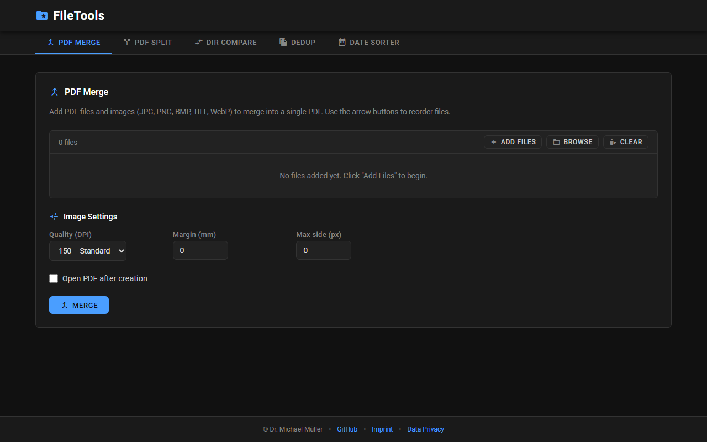
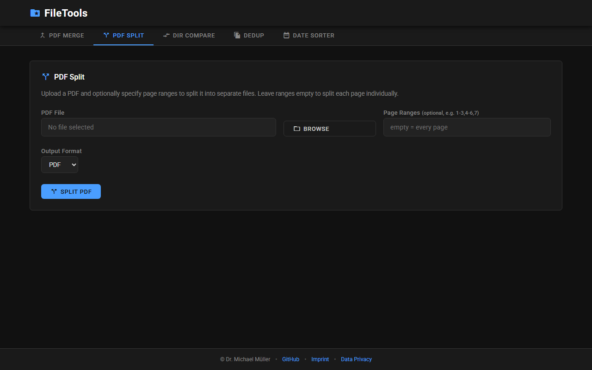
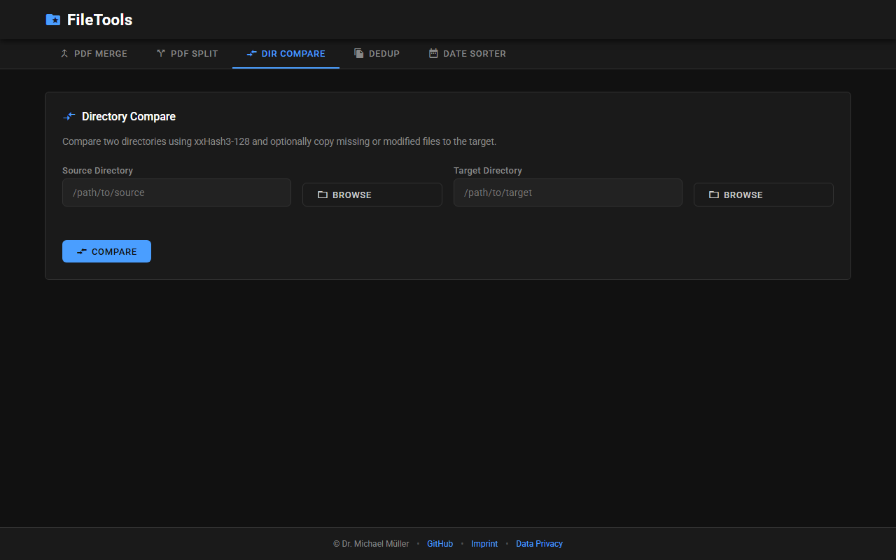
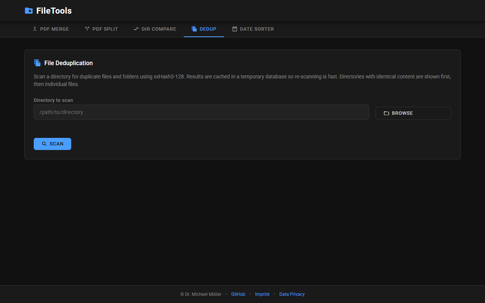
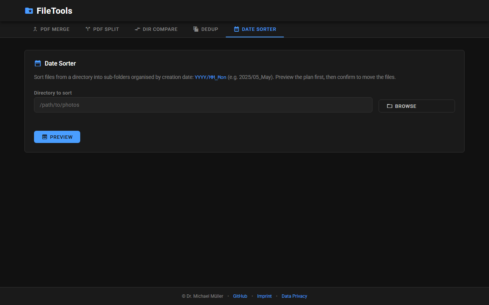

# FileTools

A local-first desktop application for everyday file operations — PDF merging & splitting, directory comparison & sync, duplicate file detection, and date-based photo sorting. Built with **FastAPI**, **pywebview**, and a dark-themed single-page HTML frontend. All processing happens entirely on your machine; no data ever leaves your device.

> **Note:** This project was created with the help of AI (GitHub Copilot / Claude). Dr. Michael Müller is the author and maintainer.



---

## Features

### PDF Merge
Combine multiple PDF files into a single document. Drag & drop to reorder files before merging.


### PDF Split
Extract specific page ranges from a PDF, or split every page into individual image files (PNG).



### Directory Compare & Sync
Compare two directories side by side. Shows files that are only in the left or right directory and files that differ. One-click sync to make both directories match.



### File Deduplication
Scan a directory tree for duplicate files and folders using xxHash3-128. Results are cached in a temporary database for fast re-scanning. Delete duplicates to the Recycle Bin.



### Date Sorter
Sort files (especially photos) into `YYYY/MM_Mon` subdirectories based on their creation date. Reads **EXIF metadata** (`DateTimeOriginal`) for accurate photo dates, falling back to filesystem timestamps.



---

## Installation

### Prerequisites

- **Python 3.11+**
- **Windows 10/11** (pywebview uses EdgeChromium; other platforms may work in web mode)

### Quick Start

```bash
# Clone the repository
git clone https://github.com/MichaelMueller/FileTools.git
cd FileTools

# Create a virtual environment
python -m venv .venv

# Activate the environment
# Windows PowerShell:
.venv\Scripts\Activate.ps1
# Windows CMD:
.venv\Scripts\activate.bat
# Linux / macOS:
source .venv/bin/activate

# Install dependencies
pip install -e ".[dev]"
```

### Run

```bash
# Desktop mode (default) — opens a native window
python file_tools.py

# Web mode — opens a plain HTTP server on port 8000
python file_tools.py --web

# Build a Windows NSIS installer
python file_tools.py installer
```

---

## Usage Hints

| Feature | Tip |
|---|---|
| **PDF Merge** | Click **Add Files** or drag PDFs onto the file list. Reorder with the arrow buttons. Hit **Merge** to produce a single PDF. |
| **PDF Split** | Browse for a PDF, enter page ranges like `1-3, 5, 8-10`, and choose between PDF output or PNG images. |
| **Dir Compare** | Browse for two directories. After comparison, review the diff table and click **Sync** to align them. |
| **Dedup** | Browse for a directory and click **Scan**. Duplicate groups appear with size info. Select duplicates to move them to the Recycle Bin. |
| **Date Sorter** | Browse for a flat folder of photos/files. Click **Preview** to see the planned folder structure, then **Sort Files Now** to execute. Works best with JPEG photos that contain EXIF data. |

---

## Technology Stack

| Layer | Technology |
|---|---|
| Backend | [FastAPI](https://fastapi.tiangolo.com/) + [Uvicorn](https://www.uvicorn.org/) |
| Desktop shell | [pywebview](https://pywebview.flowrl.com/) (EdgeChromium) |
| Frontend | Plain HTML, CSS, vanilla JavaScript (no frameworks) |
| PDF processing | [pypdf](https://pypdf.readthedocs.io/), [pypdfium2](https://pypdfium2.readthedocs.io/) |
| Hashing | [xxHash](https://github.com/Cyan4973/xxHash) (xxHash3-128) |
| Image / EXIF | [Pillow](https://python-pillow.org/) |
| Database | [SQLAlchemy](https://www.sqlalchemy.org/) (SQLite) |
| Installer | [NSIS](https://nsis.sourceforge.io/) |

---

## Development

### Project Structure

```
FileTools/
├── file_tools.py              # CLI entry-point
├── pyproject.toml             # Project metadata & dependencies
├── file_tools/
│   ├── __init__.py
│   ├── main.py                # FastAPI app & all API endpoints
│   ├── desktop.py             # pywebview wrapper
│   ├── splash.py              # Win32 splash screen
│   ├── static/
│   │   ├── index.html         # Single-page frontend
│   │   ├── icon.ico           # App icon
│   │   └── fonts/             # Bundled Roboto & Material Icons
│   ├── tools/
│   │   ├── pdf_tools.py       # PDF merge, split, split-to-images
│   │   ├── dir_compare.py     # Directory compare & sync
│   │   ├── dedup_scanner.py   # Duplicate file/folder detection
│   │   ├── date_sorter.py     # Date-based file sorting (EXIF)
│   │   └── installer_builder.py
│   └── tests/
│       ├── conftest.py
│       ├── test_main.py
│       ├── test_pdf_tools.py
│       ├── test_dir_compare.py
│       ├── test_dedup_scanner.py
│       ├── test_date_sorter.py
│       ├── test_desktop.py
│       └── test_installer_builder.py
├── build/
│   └── installer/             # NSIS installer scripts & staging
└── docs/
    ├── agent_log.md           # AI agent changelog
    └── screenshots/           # README screenshots
```

### Coding Conventions

- **One class per file**, file names in `snake_case`, class names in `CamelCase`
- No public symbols outside classes (except imports)
- Every piece of data lives in the database (SQLAlchemy, SQLite)
- Frontend: plain HTML + CSS, dark theme, no JavaScript frameworks
- Templating: Jinja2 where needed

### Running Tests

```bash
# Run the full test suite with coverage
pytest

# Run a single test file
pytest file_tools/tests/test_date_sorter.py -v

# Run with coverage report
pytest --cov=file_tools --cov-report=term-missing
```

Tests target **100% code coverage** with no warnings or errors.

### Building the Installer

Requires [NSIS](https://nsis.sourceforge.io/) installed and `makensis` on your PATH.

```bash
python file_tools.py installer
```

The installer executable is written to `build/`.

---

## Privacy

FileTools is a fully offline application. All file processing happens locally. No data is transmitted to external servers, no cookies or tracking are used, and all fonts/icons are bundled locally. See the in-app **Data Privacy** section for full details.

---

## Author

**Dr. Michael Müller**

- Website: [michaelmuelleronline.de](https://michaelmuelleronline.de)
- GitHub: [github.com/MichaelMueller](https://github.com/MichaelMueller)
- Project: [github.com/MichaelMueller/FileTools](https://github.com/MichaelMueller/FileTools)

---

## License

Licensed under the [Apache License 2.0](LICENSE).